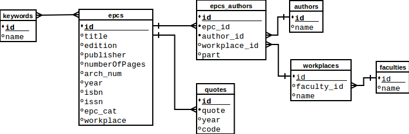

**Project modules** 

**1.** CREPCParser - scrapping data(only keywords) from CREPC website 

**2.** EPCParser - scrapping data from EPC website

!!! Modules can be run separately in Main.py  !!!

**How to scrap data:**

**1.** Based on your OS select proper driver in ElementOperations class (all drivers are stored in drivers folder)

**2.** src/config - contains config.yml where you can setup what data you want to scrap

**3.** Run Main.py to start scrapping(all data will be stored to data folder as csv file, HTML page will be also downloaded and saved to html_tables folder)

**ADDITIONAL INFO:** 

**1.** EPC page sometimes freezes so script will fail to complete scrapping

**2.** Saving data can sometimes be slow, because of the amount of data

**3.** Estimated time to scrap all data(SJF + REK + keywords) is approximately 1 day

**ER Diagram**

**DB Schema**

**DB Script**
**1.** Place data file (.csv) to ./dbScript
**2.** cd ./dbScript
**3.** npm install
**4.** npm run start

Note: DB script requires installed Nodejs and npm.
